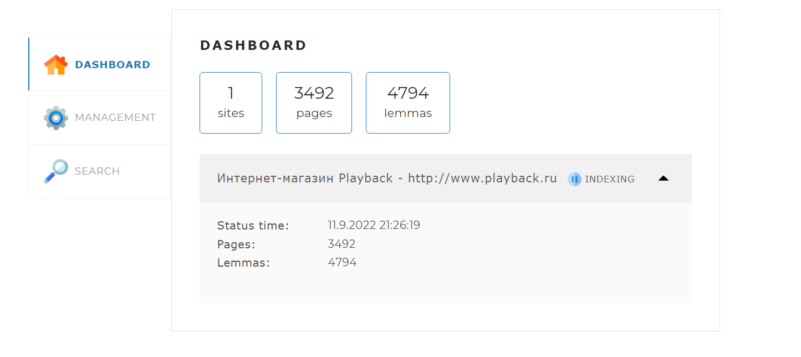
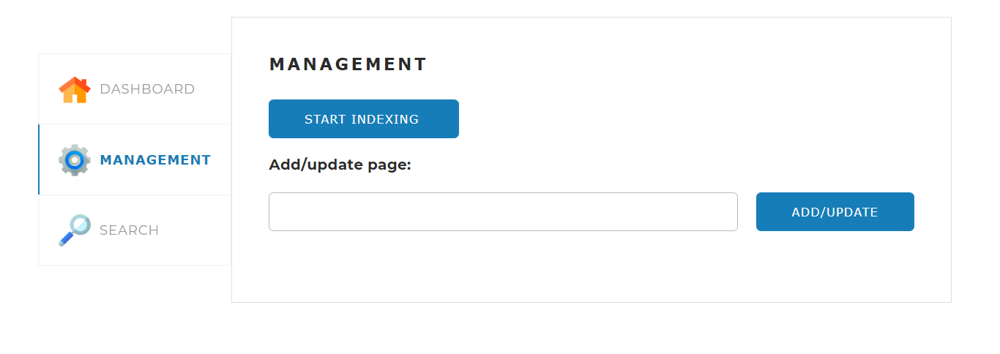
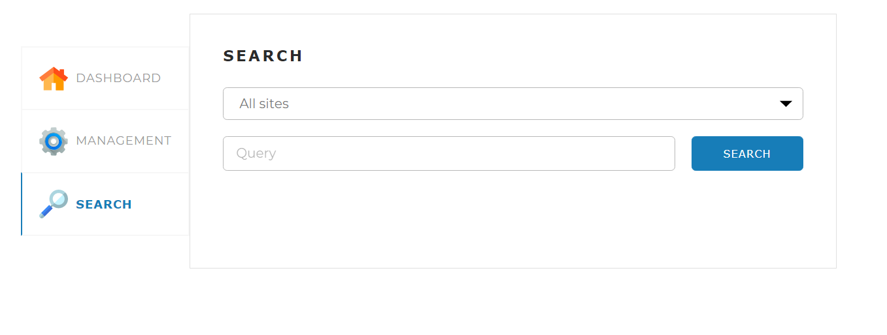
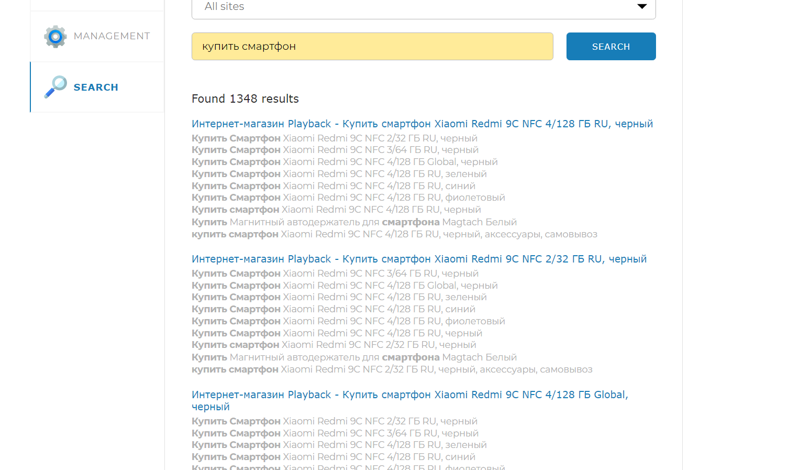
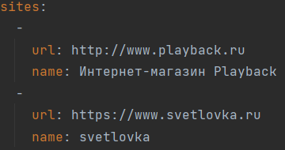

# Local Site Search Engine


--------------------

## Description

Данный проект представляет собой поисковой движок, позволяющий
производить поиск по поисковому запросу на всех страницах одного
или нескольких сайтов одновременно. Система индексирует сайты и
создаёт базу данных, хранящую в себе всю информацию об их страницах.

## About the project

### Interactive menu

Весь проект размещён на фреймворке Spring, что позволяет удобно
пользоваться им через браузер при помощи интерактивного меню,
а также даёт возможность в будущем разместить данный проект на хостинге.

Данная вкладка является основной, на ней выводится статистика индексации,
также можно просмотреть текущее состояние индексации каждого сайта,
количество проиндексированных страниц и найденных лемм(начальных
форм слов).



Вкладка Management позволяет управлять процессом индексации, запускать и
останавливать её, также есть функция отдельной индексации/переиндексации
конкретной страницы по её url.



Вкладка Search является отдельная вкладка с поисковой строкой, которая
принимает поисковой запрос, обрабатывает его и выводит в виде списка сайтов
с совпадениями. Также на вкладке есть выпадающий список для выбора определённого
сайта для поиска.




### Search result

Результат поисковой системы выводится в удобочитаемом виде, найденные слова
выделены жирным шрифтом, каждое совпадение расположено на отдельной строке.
У каждого результата присутствует ссылка на соответствующую ему страницу.
Также все результаты отсортированы по релевантности.



### Technology stack and features

- Вся backend составляющая написана на языке Java, frontend часть была
  заимствована.
- Spring Framework является неотъемлемой частью проекта. Используется для
  вывода проекта в браузер, позволяя использовать его функции при помощи
  соответственных запросов на локальном хосте.
- Данный проект использует реляционную MySQL для хранения информации, связь
  с БД производится основном при помощи Spring Framework, в некоторых случая - JDBC.
- Все зависимости подключены при помощи технологии Maven.
- Индексация сайтов происходит с приблизительной скоростью 300 страниц в
  минуту.

### Project source code

К классам и методам в проекте содержаться комментарии, объясняющие
особенности поведения и синтаксис.

## How to launch the Project

Для запуска проекта необходимо иметь MySQL на вашем ПК для сохранения
информации об индексации. Если на вашем устройстве нет данной программы, её
можно скачать по этой [ссылке](https://dev.mysql.com/downloads/workbench/ "https://dev.mysql.com/downloads/workbench/"),
проследовать инструкциям, установить и задать логин и пароль для локальной сети.
  
После установки MySQL вам потребуется настроить конфигурационный файл
(application.yml), задав в нём несколько значений:
- Логин(username) и пароль(password) вашей локальной сети.
- Путь к локальной сети (url), если отличается от стандартного
(localhost:3306).
- Список сайтов, которые будут проиндексированны. Заполнять по данному примеру
(Важно! На конце url не должно быть обратного слэша ' / ').
  

- Также можно задать значение параметру limit, который отвечает за
формат вывода страниц при поиске (Необязательно).
  
После настройки конфигурации, можно запускать проект и пользоваться им.

Чтобы запустить проект достаточно вести в командной строке следующее

```
java -jar launcher/LocalSiteSearchEngine-1.0-SNAPSHOT.jar
```
  
Чтобы открыть интерактивное меню надо перейти по ссылке, указанной в
html файле, хранящем html код страницы. После запуска проекта достаточно
ввести [localhost:8080](http://localhost:8080/) в адресной строке браузера
и откроется меню.
